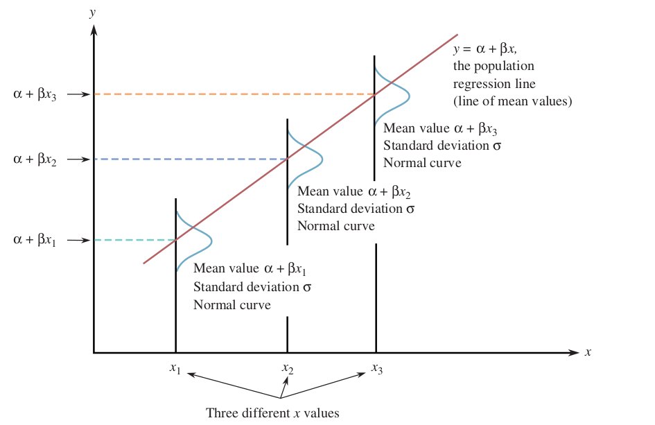
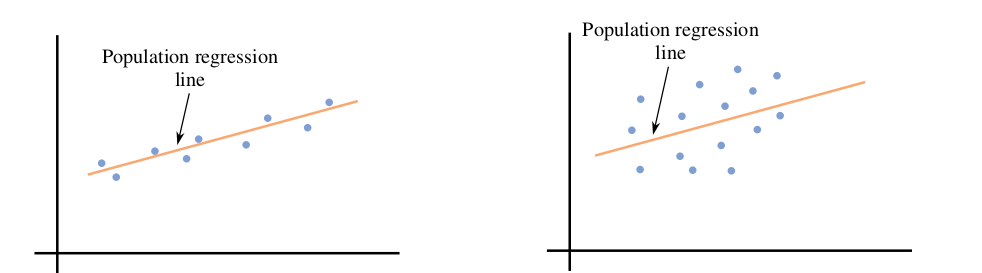

## Тестирование гипотез о разности долей двух бинарных признаков

### Иначе: о разностях вероятностей успеха у двух случайных величин Бернулли

\begin{itemize}
    \item Предположим, у нас есть случайная выборка $\mathcal{X} = \{X_1, \ldots, X_n\}$ из распределения Бернулли с $P(X_i = 1) = p_1$, и случайная выборка $\mathcal{Y} = \{Y_1, \ldots, Y_m\}$ из распределения Бернулли с $P(Y_i = 1) = p_2$. Тогда обе случайные выборки - процессы Бернулли длины $n$ и $m$ соответственно.

    \item Нас интересует разность истинных долей (или, то же самое, разность вероятностей успеха):
    $$
      \theta = p_1 - p_2
    $$

    \item Если $n, m > 30$, то по ИТМЛ:
    $$
    \hat{p}_1 \sim \mathcal{N}\left(p_1, \frac{p_1(1-p_1)}{n}\right), \quad \hat{p}_2 \sim \mathcal{N}\left(p_2, \frac{p_2(1-p_2)}{m}\right)
    $$
    \item Введём точечную оценку $\hat{\theta} = \hat{p}_1 - \hat{p}_2$ — разность двух выборочных долей.
    \item Свойства точечной оценки: $E[\hat{\theta}] = p_1 - p_2$, $Var[\hat{\theta}] = \frac{p_1(1-p_1)}{n} + \frac{p_2(1-p_2)}{m}$.
    \item Так как сумма двух нормальных случайных величин — нормальная случайная величина:
    $$
    \hat{\theta} \sim \mathcal{N}\left(p_1 - p_2, \frac{p_1(1-p_1)}{n} + \frac{p_2(1-p_2)}{m}\right)
    $$
\end{itemize}

## Тестирование гипотез о разности долей двух бинарных признаков
### Пример 1: левосторонний тест

Фармацевтическая компания тестирует новое лекарство против стандартного лечения. Вопрос: имеет ли новое лекарство более высокую долю выздоровления, чем стандартное лечение?

\begin{itemize}
    \item Разработка лекарств затратна и требует много времени. Даже небольшие улучшения в доле выздоровления могут спасти жизни и снизить затраты на здравоохранение. Статистическая валидация критически важна перед получением регуляторного одобрения.
    \item Данные:
    \begin{itemize}
        \item Стандартное лечение (A): $n = 800$ пациентов, $\tilde{p}_A = 0.65$ (65\% доля выздоровления)
        \item Новое лекарство (B): $m = 400$ пациентов, $\tilde{p}_B = 0.72$ (72\% доля выздоровления)
    \end{itemize}
    \item Гипотезы:
    \begin{itemize}
        \item $H_0: p_A = p_B$ (новое лекарство не более эффективно)
        \item $H_1: p_A < p_B$ (новое лекарство имеет более высокую долю выздоровления)
    \end{itemize}
\end{itemize}

## Тестирование гипотез о разности долей двух бинарных признаков
### Односторонний тест

\begin{itemize}
    \item Идея: мы можем ввести новую случайную величину $D = \hat{p}_1 - \hat{p}_2$
    \item Её параметры: $E[D] = p_1 - p_2$, $Var[D] = \frac{p_1(1-p_1)}{n} + \frac{p_2(1-p_2)}{m}$
    \item Если $p_1 = p_2$, то $E[D] = 0$, если $p_1 < p_2$, то $E[D] < 0$
    \item Таким образом, задача сравнения $p_1$ с $p_2$ сводится к тестированию математического ожидания одной случайной величины $D$:
    $$
    H_0: \; E[D] = 0, \; H_1: \; E[D] < 0
    $$
\end{itemize}

## Тестирование гипотез о разности долей двух бинарных признаков
### Односторонний тест

Для тестирования $H_0: p_1 - p_2 = 0$ против $H_1: p_1 - p_2 < 0$, предположим $p_1 = p_2 = p_c$ (общая доля при нулевой гипотезе):

\begin{itemize}
    \item Распределение \textit{при нулевой гипотезе}:
    $$
    \colorbox{red!20}{$D \sim \mathcal{N} \left( 0, \quad  \frac{p_c(1-p_c)}{n} + \frac{p_c(1-p_c)}{m} \right) = \mathcal{N} \left( 0, \quad  p_c(1-p_c) \left(\frac{1}{n} + \frac{1}{m}\right) \right)$}
    $$
    
    \item Используем $z$-статистику для преобразования данных в шкалу стандартного нормального распределения:
    $$
    z_{\text{score}} = \colorbox{red!20}{$\frac{\tilde{p}_1 - \tilde{p}_2}{\sqrt{p_{c}(1-p_{c}) \left(\frac{1}{n} + \frac{1}{m}\right)}}$}
    $$
    
    \item Объединённая (общая) доля $p_{c}$ — это наша оценка общей доли при нулевой гипотезе:
    $$
    p_{c} = \frac{\tilde{p}_1 n + \tilde{p}_2 m}{n + m}
    $$
    
    \item Правило принятия решения: Отклонить $H_0$, если $z_{\text{score}} < -z_{\alpha}$ в левостороннем тесте или если $z_{\text{score}} > z_{\alpha}$ в правостороннем тесте.
\end{itemize}

## Тестирование гипотез о разности долей двух бинарных признаков
### Пример 1: решение

\begin{itemize}
    \item \textbf{Гипотезы}: $H_0: p_A = p_B$ против $H_1: p_A < p_B$ (левосторонний тест)
    
    \item \textbf{Данные}: $n = 800$, $m = 400$, $\tilde{p}_A = 0.65$, $\tilde{p}_B = 0.72$, $\alpha = 0.05$
    
    \item \textbf{Объединённая доля}:
    $$
    p_c = \frac{0.65 \cdot 800 + 0.72 \cdot 400}{800 + 400} = \frac{520 + 288}{1200} = 0.673
    $$
    
    \item \textbf{$z$-статистика}: $z_{0.05} = 1.645$
    $$
    z_{\text{score}} = \frac{0.65 - 0.72}{\sqrt{0.673 \cdot 0.327 \cdot \left(\frac{1}{800} + \frac{1}{400}\right)}} = \frac{-0.07}{\sqrt{0.220 \cdot 0.00375}} \approx -2.58
    $$
    
    \item \textbf{Решение}: $z_{\text{score}} = -2.58 < -z_{0.05} = -1.645$, поэтому отклоняем $H_0$.
    
    \item \textbf{Вывод}: Имеются достаточно статистически значимые основания для утверждения, что новое лекарство более эффективно, чем стандартное лечение. Консервативная гипотеза отклоняется в пользу альтернативной.
\end{itemize}

## Тестирование гипотез о разности долей двух бинарных признаков
### Пример 2: двусторонний тест

Сеть ресторанов сравнивает уровень удовлетворённости клиентов между двумя локациями. Вопрос: есть ли значимая разница в уровне удовлетворённости?

\begin{itemize}
    \item Удовлетворённость клиентов — важный фактор успеха бизнеса. Понимание различий между локациями может помочь в распределении ресурсов и выборе стратегии развития.
    \item Данные:
    \begin{itemize}
        \item Локация A: $n = 200$ клиентов, $\tilde{p}_A = 0.85$ (85\% удовлетворены)
        \item Локация B: $m = 200$ клиентов, $\tilde{p}_B = 0.78$ (78\% удовлетворены)
    \end{itemize}
    \item Гипотезы:
    \begin{itemize}
        \item $H_0: p_A = p_B$ (нет разницы в уровне удовлетворённости)
        \item $H_1: p_A \neq p_B$ (разные уровни удовлетворённости)
    \end{itemize}
\end{itemize}

## Тестирование гипотез о разности долей двух бинарных признаков
### Двусторонний тест

Для тестирования $H_0: p_1 - p_2 = 0$ против $H_1: p_1 - p_2 \neq 0$:

\begin{itemize}
    \item Распределение \textit{при нулевой гипотезе}:
    $$
    \colorbox{red!20}{$D \sim \mathcal{N} \left( 0, \quad  p_c(1-p_c) \left(\frac{1}{n} + \frac{1}{m}\right) \right)$}
    $$
    
    \item $z$-статистика:
    $$
    z_{\text{score}} = \colorbox{red!20}{$\frac{\tilde{p}_1 - \tilde{p}_2}{\sqrt{p_{c}(1-p_{c}) \left(\frac{1}{n} + \frac{1}{m}\right)}}$}
    $$
    
    \item Объединённая доля:
    $$
    p_{c} = \frac{\tilde{p}_1 n + \tilde{p}_2 m}{n + m}
    $$
    
    \item Правило принятия решения: Отклонить $H_0$, если $|z_{\text{score}}| > z_{\alpha/2}$.
\end{itemize}

## Тестирование гипотез о разности долей двух бинарных признаков
### Пример 2: решение

\begin{itemize}
    \item \textbf{Гипотезы}: $H_0: p_A = p_B$ против $H_1: p_A \neq p_B$ (двусторонний тест)
    
    \item \textbf{Данные}: $n = 200$, $m = 200$, $\tilde{p}_A = 0.85$, $\tilde{p}_B = 0.78$, $\alpha = 0.05$
    
    \item \textbf{Объединённая доля}:
    $$
    p_c = \frac{0.85 \cdot 200 + 0.78 \cdot 200}{200 + 200} = \frac{170 + 156}{400} = 0.815
    $$
    
    \item \textbf{$z$-статистика}: $z_{0.025} = 1.96$
    $$
    z_{\text{score}} = \frac{0.85 - 0.78}{\sqrt{0.815 \cdot 0.185 \cdot \left(\frac{1}{200} + \frac{1}{200}\right)}} = \frac{0.07}{\sqrt{0.151 \cdot 0.01}} \approx 1.80
    $$
    
    \item \textbf{Решение}: $|z_{\text{score}}| = 1.80 < z_{0.025} = 1.96$, поэтому не отклоняем $H_0$.
    
    \item \textbf{Вывод}: Результаты тестирования не предоставляют достаточных статистически значимых оснований для отклонения нулевой гипотезы. Нет достаточных оснований утверждать, что существует статистически значимая разница в уровне удовлетворённости клиентов между двумя локациями.
\end{itemize}

## Гипотезы о разности математических ожиданий при неизвестных дисперсиях
### Точечная оценка разности математических ожиданий

\begin{itemize}
    \item Предположим, у нас есть две независимые выборки: $\mathcal{X} = \{X_1, \ldots, X_n\}$, $\mathcal{Y} = \{Y_1, \ldots, Y_m\}$. Характеристики называем $\mu_X \equiv E[X_i]$, $\sigma_X^2 \equiv Var[X_i]$, и соответственно $\mu_Y \equiv E[Y_i]$, $\sigma_Y^2 \equiv Var[Y_i]$
    \item Нас интересует разность истинных математических ожиданий:
    $$
      \theta = \mu_X - \mu_Y
    $$

    \item Введём точечную оценку $\hat{\theta} = \bar{X} - \bar{Y}$ — разность двух выборочных средних.
    \item Свойства точечной оценки: $E[\hat{\theta}] = \mu_X - \mu_Y$, $Var[\hat{\theta}] = \frac{\sigma^2_X}{n} + \frac{\sigma^2_Y}{m}$.

    \item При $n,\, m > 30$ работает ЦПТ и распределение точечной оценки для $\theta$:
    \begin{equation*}
    \hat{\theta} \sim \mathcal{N} \left(\mu_X - \mu_Y, \, \frac{\sigma^2_X}{n} + \frac{\sigma^2_Y}{m}   \right)
    \end{equation*}
\end{itemize}

## Гипотезы о разности математических ожиданий при неизвестных дисперсиях
### Пример 3: левосторонний тест

Интернет-магазин тестирует новый дизайн сайта против текущего дизайна. Вопрос: увеличивает ли новый дизайн среднюю стоимость заказа?

\begin{itemize}
    \item Изменения в дизайне сайта могут значительно повлиять на поведение пользователей и выручку. Даже небольшие улучшения в средней стоимости заказа могут привести к существенному увеличению доходов.
    \item Данные:
    \begin{itemize}
        \item Текущий дизайн (A): $n = 100$ клиентов, $\bar{x}_A = 85$ долларов, $s_A = 15$ долларов
        \item Новый дизайн (B): $m = 100$ клиентов, $\bar{x}_B = 92$ доллара, $s_B = 18$ долларов
    \end{itemize}
    \item Гипотезы:
    \begin{itemize}
        \item $H_0: \mu_A = \mu_B$ (нет разницы в средней стоимости заказа)
        \item $H_1: \mu_A < \mu_B$ (новый дизайн увеличивает среднюю стоимость заказа)
    \end{itemize}
\end{itemize}

## Гипотезы о разности математических ожиданий при неизвестных дисперсиях
### Односторонний тест (тест Уэлча)

\begin{itemize}
    \item Идея: мы можем ввести новую случайную величину $D = \bar{X} - \bar{Y}$
    \item Её параметры: $E[D] = \mu_X - \mu_Y$, $Var[D] = \frac{\sigma_X^2}{n} + \frac{\sigma_Y^2}{m}$
    \item Если $\mu_X = \mu_Y$, то $E[D] = 0$, если $\mu_X < \mu_Y$, то $E[D] < 0$
    \item Таким образом, задача сравнения $\mu_X$ с $\mu_Y$ сводится к тестированию математического ожидания одной случайной величины $D$:
    $$
    H_0: \; E[D] = 0, \; H_1: \; E[D] < 0
    $$
\end{itemize}

## Гипотезы о разности математических ожиданий при неизвестных дисперсиях
### Односторонний тест (тест Уэлча)

Для тестирования $H_0: \mu_X - \mu_Y = 0$ против $H_1: \mu_X - \mu_Y < 0$:

\begin{itemize}
    \item Распределение \textit{при нулевой гипотезе}: $\colorbox{red!20}{$\bar{X} - \bar{Y} \sim \mathcal{N}\left(0, \frac{\sigma_X^2}{n} + \frac{\sigma_Y^2}{m}\right)$}$, $\colorbox{red!20}{$\frac{\bar{X} - \bar{Y}}{\sqrt{ \frac{S_X^2}{n} + \frac{S_Y^2}{m}}} \sim t_{k}$}$
    
    \item Число степеней свободы $k$ задаётся формулой:
    $$
    k \approx \frac{(V_X + V_Y)^2}{\frac{V_X^2}{n-1} + \frac{V_Y^2}{m-1}}, \text{ где } V_X = \frac{S_X^2}{n}, \; V_Y = \frac{S_Y^2}{m}
    $$
    
    \item Используем $t$-статистику:
    $$
    t_{\text{score}} = \colorbox{red!20}{$\frac{\bar{x} - \bar{y}}{\sqrt{ \frac{s_X^2}{n} + \frac{s_Y^2}{m}}}$}
    $$
    
    \item Правило принятия решения: Отклонить $H_0$, если $t_{\text{score}} < -t_{(k, \alpha)}$ в левостороннем тесте или если $t_{\text{score}} > t_{(k, \alpha)}$ в правостороннем тесте.
\end{itemize}

## Гипотезы о разности математических ожиданий при неизвестных дисперсиях
### Пример 3: решение

\begin{itemize}
    \item \textbf{Гипотезы}: $H_0: \mu_A = \mu_B$ против $H_1: \mu_A < \mu_B$ (левосторонний тест)
    
    \item \textbf{Данные}: $n = 100$, $m = 100$, $\bar{x}_A = 85$, $\bar{x}_B = 92$, $s_A = 15$, $s_B = 18$, $\alpha = 0.05$
    
    \item \textbf{Степени свободы}:
    $$
    V_A = \frac{15^2}{100} = 2.25, \quad V_B = \frac{18^2}{100} = 3.24
    $$
    $$
    k = \frac{(2.25 + 3.24)^2}{\frac{2.25^2}{99} + \frac{3.24^2}{99}} = \frac{30.14}{0.051 + 0.106} \approx 192
    $$
    
    \item \textbf{$t$-статистика}: $t_{(192, 0.05)} \approx 1.653$ (используем $t_{(200, 0.05)}$ как приближение)
    $$
    t_{\text{score}} = \frac{85 - 92}{\sqrt{\frac{15^2}{100} + \frac{18^2}{100}}} = \frac{-7}{\sqrt{2.25 + 3.24}} = \frac{-7}{2.34} \approx -2.99
    $$
    
    \item \textbf{Решение}: $t_{\text{score}} = -2.99 < -t_{(192, 0.05)} \approx -1.653$, поэтому отклоняем $H_0$.
    
    \item \textbf{Вывод}: Имеются достаточно статистически значимые основания для утверждения, что новый дизайн увеличивает среднюю стоимость заказа по сравнению с текущим дизайном. Консервативная гипотеза отклоняется в пользу альтернативной.
\end{itemize}

## Гипотезы о разности математических ожиданий при неизвестных дисперсиях
### Пример 4: двусторонний тест

Производственная компания сравнивает эффективность производства между двумя заводами. Вопрос: есть ли значимая разница в среднем времени производства единицы продукции?

\begin{itemize}
    \item Эффективность производства напрямую влияет на затраты и сроки доставки клиентам. Понимание различий в производительности помогает в распределении ресурсов и оптимизации процессов.
    \item Данные:
    \begin{itemize}
        \item Завод A: $n = 100$ единиц, $\bar{x}_A = 45$ минут, $s_A = 8$ минут
        \item Завод B: $m = 80$ единиц, $\bar{x}_B = 42$ минуты, $s_B = 7$ минут
    \end{itemize}
    \item Гипотезы:
    \begin{itemize}
        \item $H_0: \mu_A = \mu_B$ (нет разницы в среднем времени производства)
        \item $H_1: \mu_A \neq \mu_B$ (разные средние времена производства)
    \end{itemize}
\end{itemize}

## Гипотезы о разности математических ожиданий при неизвестных дисперсиях
### Двусторонний тест (тест Уэлча)

Для тестирования $H_0: \mu_X - \mu_Y = 0$ против $H_1: \mu_X - \mu_Y \neq 0$:

\begin{itemize}
    \item Распределение \textit{при нулевой гипотезе}: $\colorbox{red!20}{$\bar{X} - \bar{Y} \sim \mathcal{N}\left(0, \frac{\sigma_X^2}{n} + \frac{\sigma_Y^2}{m}\right)$}$, $\colorbox{red!20}{$\frac{\bar{X} - \bar{Y}}{\sqrt{ \frac{S_X^2}{n} + \frac{S_Y^2}{m}}} \sim t_{k}$}$
    
    \item Число степеней свободы:
    $$
    k \approx \frac{(V_X + V_Y)^2}{\frac{V_X^2}{n-1} + \frac{V_Y^2}{m-1}}, \text{ где } V_X = \frac{S_X^2}{n}, \; V_Y = \frac{S_Y^2}{m}
    $$
    
    \item $t$-статистика:
    $$
    t_{\text{score}} = \colorbox{red!20}{$\frac{\bar{x} - \bar{y}}{\sqrt{ \frac{s_X^2}{n} + \frac{s_Y^2}{m}}}$}
    $$
    
    \item Правило принятия решения: Отклонить $H_0$, если $|t_{\text{score}}| > t_{(k, \alpha/2)}$.
\end{itemize}

## Гипотезы о разности математических ожиданий при неизвестных дисперсиях
### Пример 4: решение

\begin{itemize}
    \item \textbf{Гипотезы}: $H_0: \mu_A = \mu_B$ против $H_1: \mu_A \neq \mu_B$ (двусторонний тест)
    
    \item \textbf{Данные}: $n = 100$, $m = 80$, $\bar{x}_A = 45$, $\bar{x}_B = 42$, $s_A = 8$, $s_B = 7$, $\alpha = 0.05$
    
    \item \textbf{Степени свободы}:
    $$
    V_A = \frac{8^2}{100} = 0.64, \quad V_B = \frac{7^2}{80} = 0.613
    $$
    $$
    k = \frac{(0.64 + 0.613)^2}{\frac{0.64^2}{99} + \frac{0.613^2}{79}} = \frac{1.57}{0.0041 + 0.0048} \approx 175
    $$
    
    \item \textbf{$t$-статистика}: $t_{(175, 0.025)} \approx 1.976$ (используем $t_{(200, 0.025)}$ как приближение)
    $$
    t_{\text{score}} = \frac{45 - 42}{\sqrt{\frac{8^2}{100} + \frac{7^2}{80}}} = \frac{3}{\sqrt{0.64 + 0.613}} = \frac{3}{1.12} \approx 2.68
    $$
    
    \item \textbf{Решение}: $|t_{\text{score}}| = 2.68 > t_{(175, 0.025)} \approx 1.976$, поэтому отклоняем $H_0$.
    
    \item \textbf{Вывод}: Имеются достаточно статистически значимые основания для утверждения, что существует разница в среднем времени производства между двумя заводами. Консервативная гипотеза отклоняется в пользу альтернативной.
\end{itemize}

## Гипотезы о разности матожиданий при неизвестных, но предположительно равных дисперсиях
### Точечная оценка разности математических ожиданий

\begin{itemize}
    \item Предположим, у нас есть две независимые выборки: $\mathcal{X} = \{X_1, \ldots, X_n\}$, $\mathcal{Y} = \{Y_1, \ldots, Y_m\}$. Характеристики называем $\mu_X \equiv E[X_i]$, $\sigma_X^2 \equiv Var[X_i]$, и соответственно $\mu_Y \equiv E[Y_i]$, $\sigma_Y^2 \equiv Var[Y_i]$
    \item Дисперсии $\sigma_X^2$ и $\sigma_Y^2$ \textbf{неизвестны}, но для простоты предполагаем, что они равны: $\sigma_X^2 = \sigma_Y^2 = \sigma^2$.
    \item Нас интересует разность истинных математических ожиданий:
    $$
      \theta = \mu_X - \mu_Y
    $$

    \item Введём точечную оценку $\hat{\theta} = \bar{X} - \bar{Y}$ — разность двух выборочных средних.
    \item Свойства точечной оценки: $E[\hat{\theta}] = \mu_X - \mu_Y$, $Var[\hat{\theta}] = \sigma^2 \left(\frac{1}{n} + \frac{1}{m} \right)$.

    \item При $n,\, m > 30$ работает ЦПТ и распределение точечной оценки для $\theta$:
    \begin{equation*}
    \hat{\theta} \sim \mathcal{N} \left(\mu_X - \mu_Y, \, \sigma^2 \left(\frac{1}{n} + \frac{1}{m} \right) \right)
    \end{equation*}
    \item Проблема: мы не можем использовать $\sigma^2$ при тестировании гипотез, так как дисперсия неизвестна!
\end{itemize}

---

## Гипотезы о разности матожиданий при неизвестных, но предположительно равных дисперсиях
### Объединенная выборочная дисперсия

\begin{itemize}
    \item Решение: заменяем неизвестную дисперсию $\sigma^2$ на её оценку — объединённую выборочную дисперсию $S_p^2$, и используем $t$-распределение вместо нормального.
    
    \item Вводим $t$-распределённую переменную:
    $$
    \frac{\bar{X} - \bar{Y} - (\mu_X - \mu_Y)}{S_p \sqrt{\frac{1}{n} + \frac{1}{m}}} \sim t_{(n+m-2)}
    $$
    
    \item Объединённая дисперсия $S_p^2$ — это взвешенное среднее выборочных дисперсий:
    $$
    S_p^2 = \frac{(n-1) S_X^2 + (m-1) S_Y^2}{n+m-2}
    $$
    
    \item \textbf{Интуиция}: мы "объединяем" информацию о дисперсии из обеих выборок, используя веса, пропорциональные размерам выборок минус один (степени свободы). Идея в том, что чем больше размер выборки, тем точнее реализации выборочной дисперсии, и тем больше будет вес у этого слагаемого в сумме.
    
    \item Число степеней свободы: $n+m-2$ (сумма степеней свободы обеих выборок).
\end{itemize}

---

## Гипотезы о разности матожиданий при неизвестных, но предположительно равных дисперсиях

Для тестирования $H_0: \mu_X - \mu_Y = 0$ против $H_1: \mu_X - \mu_Y \begin{array}{c}
> \\[-0.8em]
<
\end{array} 0$ или $H_1: \mu_X \neq \mu_Y$.

\begin{itemize}
    \item Распределение \textit{при нулевой гипотезе}: $\colorbox{red!20}{$\bar{X} - \bar{Y} \sim \mathcal{N}\left(0, \sigma^2\left(\frac{1}{n} + \frac{1}{m}\right)\right)$}$, $\colorbox{red!20}{$\frac{\bar{X} - \bar{Y}}{S_p \sqrt{\frac{1}{n} + \frac{1}{m}}} \sim t_{(n+m-2)}$}$
    
    \item Используем $t$-статистику:
    $$
    t_{\text{score}} = \colorbox{red!20}{$\frac{\bar{x} - \bar{y}}{s_p \sqrt{\frac{1}{n} + \frac{1}{m}}}$}
    $$
    
    \item где $s_p^2$ — реализация объединённой дисперсии:
    $$
    s_p^2 = \frac{(n-1) s_X^2 + (m-1) s_Y^2}{n+m-2}
    $$
    
    \item Правило принятия решения: Отклонить $H_0$, если $t_{\text{score}} < -t_{(n+m-2, \alpha)}$ в левостороннем тесте или если $t_{\text{score}} > t_{(n+m-2, \alpha)}$ в правостороннем тесте.
    \item Для двустороннего теста: Отклонить $H_0$, если $|t_{\text{score}}| > t_{(n+m-2, \alpha/2)}$.
\end{itemize}

## Модель простой линейной регрессии

Модель простой линейной регрессии предполагает, что существует прямая с коэффициентом сдвига $\alpha$ и наклоном $\beta$, называемая истинной или генеральной линией регрессии. Когда фиксируется значение независимой переменной $x$ и делается наблюдение зависимой переменной $y$:

$$
y = \alpha + \beta x + \varepsilon
$$

Предполагаем, что некоторая случайная величина $Y$ зависит от $X$ линейным образом. Может не быть сильной линейной зависимости, но по крайней мере есть тренд линейного изменения одного параметра относительно другого.

## Основные предположения модели

\begin{enumerate}
    \item Распределение $\varepsilon$ при любом конкретном значении $x$ имеет среднее значение $0$. То есть $\mu_{\varepsilon} = 0$.
    \item Стандартное отклонение ($\sigma$) величины $\varepsilon$ (которое описывает разброс её распределения) одинаково для любого конкретного значения $x$.
    \item Распределение $\varepsilon$ при любом конкретном значении $x$ нормальное, т.е. $\varepsilon \sim \mathcal{N}(0, \sigma^2)$.
    \item Случайные отклонения $\varepsilon_1, \varepsilon_2, \ldots, \varepsilon_n$, связанные с разными наблюдениями, независимы друг от друга.
\end{enumerate}

## Иллюстрация модели регрессии

## Поведение при различных значениях $\sigma$

## Точечная оценка параметров
### МНК: Метод Наименьших Квадратов

**Выборочные средние:**
$$
\bar{x} = \frac{1}{n} \sum \limits_{i=1}^{n} x_i, \quad \bar{y} = \frac{1}{n} \sum \limits_{i=1}^{n} y_i
$$

**Суммы квадратов:**
$$
S_{xx} = \sum (x_i - \bar{x})^2, \quad S_{yy} = \sum (y_i - \bar{y})^2, \quad S_{xy} = \sum (x_i - \bar{x})(y_i - \bar{y})
$$

**Оценки параметров:**
$$
\boxed{ \hat{\alpha} = \bar{y} - \hat{\beta} \bar{x}, \quad \hat{\beta} = \frac{S_{xy}}{S_{xx}}}
$$

**Полученная (оценочная) линейная функция:**
$$
\boxed{ \hat{y} = \hat{\alpha} + \hat{\beta} x}
$$

<!-- ## Оценка дисперсии ошибок

**Сумма квадратов остатков:**
$$
\text{RSS} = \sum (y_i - \hat{\alpha} - \hat{\beta} x_i)^2 = \sum \hat{\varepsilon}_i^2
$$

**Выборочная дисперсия остатков:**
$$
S^2 = \frac{1}{n-2} \sum \hat{\varepsilon}_i^2 = \frac{1}{n-2}\left(S_{yy} - \frac{S^2_{xy}}{S_{xx}}\right)
$$

## Распределение оценки наклона

$$
\colorbox{red!20}{$\frac{\hat{\beta} - \beta}{\frac{S}{\sqrt{S_{xx}}}} \sim t_{(n-2)}$}
$$

**$(1-\alpha)100\%$ доверительный интервал для $\beta$:**
$$
\beta \in \left( \hat{\beta} - t_{(n-2, \alpha/2)} \frac{S}{\sqrt{S_{xx}}}, \hat{\beta} + t_{(n-2, \alpha/2)} \frac{S}{\sqrt{S_{xx}}}   \right)
$$ -->

<!-- ## Проверка гипотез о параметре $\beta$

\begin{align*}
H_0: \beta = \beta_0 \quad \text{против} \quad H_1: \beta \neq \beta_0
\end{align*}

**$t$-статистика:**
$$
t_{\text{score}} = \colorbox{red!20}{$\frac{\tilde{\beta} - \beta_0}{\frac{S}{\sqrt{S_{xx}}}}$}
$$

**Правило принятия решения:** Отклонить $H_0$, если $|t_{\text{score}}| > t_{(n-2, \alpha/2)}$ -->

## Коэффициент корреляции

**Выборочный коэффициент корреляции**:

$$
r = \frac{\sum \limits_{i=1}^{n} (x_i - \bar{x})(y_i - \bar{y})}{\sqrt{\sum \limits_{i=1}^{n} (x_i - \bar{x})^2 \sum \limits_{i=1}^{n} (y_i - \bar{y})^2}} = \frac{S_{xy}}{\sqrt{S_{xx} S_{yy}}}
$$

Можно использовать его для двустороннего теста, есть ли связь между переменными в генеральной совокупности.

**Распределение:**

Следующая функция коэффициента корреляции ведёт себя как $t$-переменная Стьюдента с $(n-2)$ степенями свободы (при нулевой гипотезе $\rho = 0$):

$$
\colorbox{red!20}{$r \sqrt{\frac{n-2}{1 - r^2}} \sim t_{(n-2)}$}
$$

## Тест независимости

**Гипотезы:**

\begin{align*}
H_0: \rho = 0 & \quad (\text{Нет корреляции между переменными в генеральной совокупности}) \\
H_1: \rho \neq 0 & \quad (\text{Есть корреляция между переменными в генеральной совокупности})
\end{align*}

**Правило принятия решения:**

\begin{itemize}
    \item Подставляя выборочное значение $r$, которое мы получили, вычисляем $t_{\text{score}}$ теста:
    $$
    t_{\text{score}} = \colorbox{red!20}{$r \sqrt{\frac{n-2}{1 - r^2}}$}
    $$
    \item После этого действуем обычным образом, сравнивая координаты критической точки $t_{(n-2, \alpha/2)}$ и полученный $t_{\text{score}}$ теста.
    \item Отклонить $H_0$, если $|t_{\text{score}}| > t_{(n-2, \alpha/2)}$
\end{itemize}
